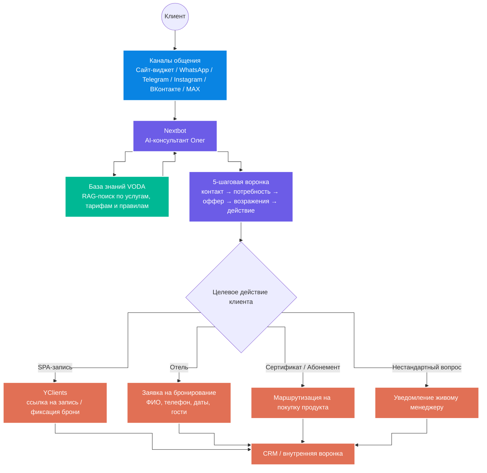

# 🌊 VODA AI: автономный нейроконсультант для Акваклуба VODA

**VODA AI** — это омниканальный AI-консультант для первой линии продаж и поддержки премиального Акваклуба VODA.

Ассистент работает в ключевых точках контакта с клиентами: **на сайте через виджет, в WhatsApp, Telegram, Instagram, ВКонтакте и MAX**.

AI-консультант спроектирован на платформе **Nextbot** и выполняет роль экспертного менеджера: консультирует гостей по услугам, помогает выбрать подходящий формат отдыха, ведёт клиента по 5-шаговой воронке продаж, отрабатывает возражения и передаёт заявку в нужный бизнес-процесс.

Решение работает на базе корпоративной базы знаний и отвечает клиентам только по утверждённой информации: тарифам, услугам, акциям, правилам, условиям записи и бронирования.

---

## 🎥 Демонстрация работы

▶️ [Посмотреть видеоразбор сквозной логики проекта](https://drive.google.com/file/d/1iT9s7o30XMPTNdAjNf3I8u6Ll3AmPBk5/view?usp=sharing)

В видео показан полный цикл работы AI-консультанта:

**первое сообщение клиента → прохождение 5-шаговой воронки → консультация по базе знаний → вызов внутренних функций → передача лида в CRM → движение по воронке продаж**

---

## 💼 Бизнес-проблема

У Акваклуба VODA широкая линейка услуг: бассейн, SPA, отель, мероприятия, сертификаты, абонементы и специальные предложения.

Из-за этого у клиентов возникает много повторяющихся вопросов:

- какие услуги доступны;
- сколько стоит посещение;
- какие есть акции;
- как записаться в SPA;
- как забронировать отель;
- какой формат отдыха выбрать;
- куда обратиться по мероприятию;
- что входит в тариф;
- как купить сертификат или абонемент.

Ресепшн и менеджеры тратили много времени на однотипные консультации в разных каналах: **сайт-виджет, WhatsApp, Telegram, Instagram, ВКонтакте и MAX**.

Из-за высокой нагрузки часть клиентов могла теряться: не получать быстрый ответ, не доходить до записи или не понимать, какой продукт им подходит.

---

## ✅ Что было реализовано

Разработан автономный AI-консультант, который берёт на себя первую линию общения с клиентами.

Система умеет:

- консультировать клиентов по услугам Акваклуба VODA;
- отвечать строго на основе утверждённой базы знаний;
- вести диалог по 5-шаговой логике продаж;
- выявлять потребности клиента;
- предлагать подходящий формат отдыха;
- отрабатывать возражения;
- отправлять клиента на запись через YClients;
- собирать лид-форму при сложных или нестандартных запросах;
- передавать данные клиента в CRM;
- вызывать живого менеджера, если вопрос требует ручной обработки.

Главная ценность решения — в том, что AI-консультант не просто отвечает на вопросы, а помогает бизнесу доводить клиента до следующего целевого действия: записи, бронирования, покупки или передачи заявки менеджеру.

---

## 🏗 Архитектура

📈 Результат для бизнеса

После внедрения AI-консультанта бизнес получает автоматизированную первую линию продаж и поддержки во всех ключевых каналах коммуникации.

Система позволяет:

снизить нагрузку на ресепшн и менеджеров;
быстрее отвечать клиентам в сайте-виджете и мессенджерах;
не терять заявки из-за долгого ожидания ответа;
консультировать клиентов по сложной сетке услуг и тарифов;
доводить клиента до записи, бронирования или покупки;
собирать структурированные данные для менеджера;
передавать заявки в CRM без ручного копирования;
стандартизировать качество консультаций;
поддерживать единый Tone of Voice бренда;
повысить конверсию из обращения в целевое действие.

🎯 Кому подходит решение

Решение подходит компаниям, где есть большой поток входящих обращений, сложная линейка услуг и необходимость быстро консультировать клиентов в разных каналах.

Может использоваться в:

SPA-комплексах;
акваклубах;
фитнес-центрах;
wellness-бизнесе;
отелях и базах отдыха;
салонах красоты;
медицинских и оздоровительных центрах;
ресторанных и банкетных проектах;
event-площадках;
туристических компаниях;
компаниях с записью, бронированием и консультациями через сайт и мессенджеры.

🛠 Технологический стек
Инструмент	Роль в проекте;
Nextbot	AI-платформа для создания нейроконсультанта и логики диалога;
Сайт-виджет	Точка контакта для консультаций прямо на сайте Акваклуба;
WhatsApp	Канал общения с клиентами и обработки входящих заявок;
Telegram	Канал общения с клиентами и демонстрации работы ассистента;
Instagram	Канал обработки обращений из социальных сетей;
ВКонтакте	Дополнительный канал коммуникации с клиентами;
MAX	Мессенджер для обработки клиентских обращений;
Prompt Engineering	Проектирование системного промпта, логики поведения и ограничений агента;
Function Calling	Вызов внутренних функций для записи, бронирования, передачи лида и уведомления менеджера;
RAG	Поиск ответов по корпоративной базе знаний VODA без выдумывания информации;
YClients	Передача клиента на запись и фиксация целевого действия;
CRM	Сбор и передача лидов во внутреннюю систему обработки заявок;
База знаний VODA	Источник утверждённых данных по услугам, тарифам, акциям, правилам и условиям;

👨‍💼 Об авторе

Равиль Муртазин — автор проекта и специалист по AI-автоматизации бизнес-процессов.

Я помогаю бизнесу внедрять практические AI-решения: автоматизировать рутинные процессы, усиливать продажи, улучшать клиентский сервис и выстраивать управленческую аналитику.

В работе использую AI-модели, чат-ботов, CRM-интеграции, low-code/no-code платформы, автоматизированные воронки и инструменты для построения автономных бизнес-процессов.

Этот проект показывает, как AI-консультант может заменить часть рутинной первой линии поддержки, сохранить качество коммуникации бренда и помогать бизнесу быстрее доводить клиента до покупки, записи или бронирования.

Основные направления работы
AI-автоматизация бизнес-процессов;
чат-боты для продаж и клиентского сервиса;
AI-консультанты на базе корпоративных знаний;
AI-воронки и автоворонки;
автоматизация отделов продаж;
интеграции с CRM и сервисами записи;
омниканальные боты для сайта и мессенджеров;
внедрение RAG-логики и Function Calling;
AI-инструменты для руководителей и собственников бизнеса.
📎 Статус проекта

Рабочий прототип автономного AI-консультанта для Акваклуба VODA на платформе Nextbot.

Решение может быть адаптировано под разные ниши, каналы коммуникации, базы знаний, CRM-системы и сценарии продаж.
