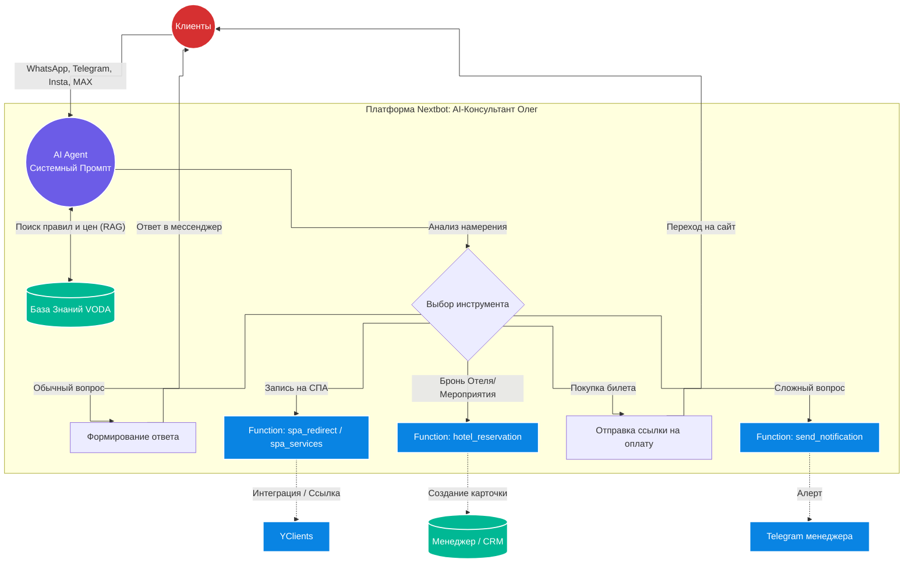

# 🌊 VODA AI: Автономный нейроконсультант "Олег"

AI-ассистент для первой линии продаж и поддержки премиального Акваклуба VODA. Агент спроектирован на платформе Nextbot и выполняет роль экспертного менеджера по продажам. 

## 💼 Бизнес-задача
* **Проблема:** Высокая нагрузка на ресепшн и колл-центр из-за сложной сетки тарифов (бассейн, спа-отель, мероприятия, абонементы). Менеджеры тратили время на рутинные консультации в разных каналах (WhatsApp, Instagram, Telegram, МАХ, Avito), а клиенты терялись при попытке самостоятельной записи на услуги.
* **Решение:** Внедрен омниканальный AI-консультант, который по 5-шаговой воронке выявляет потребности, консультирует строго по Базе Знаний (RAG), отрабатывает возражения и либо переводит клиента на прямую покупку (через YClients), либо собирает лид-форму для менеджера.

## 🏗 Архитектура решения

Схема омниканального взаимодействия и логика вызова функций:

🧠 Архитектура Промпта (System Logic)
Поведение агента жестко регламентировано системным промптом, который исключает галлюцинации и отклонения от бизнес-целей.

1. Воронка продаж (5 шагов)
Агент ведет диалог по строгому алгоритму:

Приветствие и контакт: Удержание внимания, сбор имени, озвучивание актуальных промокодов.

Выявление потребностей: Определение состава гостей, формата отдыха (семейный, романтический, корпоратив) и бюджета.

Презентация: Формирование оффера на основе выявленной потребности.

Работа с возражениями: Предложение альтернатив, снятие сомнений.

Закрытие сделки: Вызов целевой функции (Function Calling) для бронирования или передачи лида.

2. Строгие ограничения (Negative Prompts & Constraints)
Для обеспечения естественного диалога и защиты бренда внедрены жесткие правила:

Длина одного сообщения — не более 500 символов (не более 20 слов в абзаце).

Запрет на самостоятельное выдумывание цен: данные берутся только из утвержденной Базы Знаний.

Жесткий контроль Tone of Voice.

⚙️ Система триггеров и функций (Function Calling)
Агент не просто общается, но и управляет бизнес-процессами, скрыто вызывая внутренние функции (Tools) в зависимости от контекста диалога:

[lead_source] — Обязательный сбор источника при первом контакте.

[spa_redirect] + [spa_confirmed] — Бесшовная интеграция с YClients. Агент отправляет ссылку на запись и фиксирует успешную бронь.

[spa_services] — Сбор ФИО, телефона и названия услуги при сбое самостоятельной записи.

[hotel_reservation] — Формирование карточки брони (ФИО, телефон, даты, количество гостей) для передачи в бэкофис отеля.

[buy_certificate] / [buy_abonement] — Маршрутизация клиентов на покупку сложных продуктов.

[send_notification] — Экстренный вызов живого менеджера при нестандартных запросах.

🛠 Технологический стек
Омниканальность: WhatsApp, Telegram, Instagram, MAX

AI Платформа: Nextbot (Low-code)

Логика: Prompt Engineering, Function Calling, System Instructions

Данные: RAG (Retrieval-Augmented Generation) на основе корпоративной базы знаний, дожимные сообщения.

Интеграции: YClients, веб-сайт Акваклуба, внутренняя CRM.

Разработано архитектором AI-систем в рамках создания автономных бизнес-процессов.
